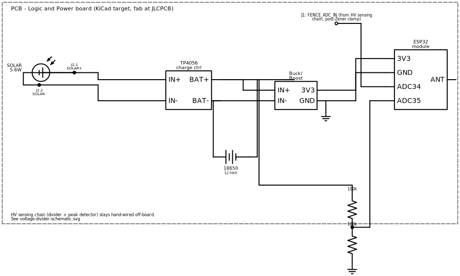

# Logic & Power Board — Schematic

The custom PCB target described in [pcb-design-plan.md](pcb-design-plan.md):
everything downstream of the HV sensing chain's second Zener clamp — solar/
battery charge management, the 3.3 V rail, the ESP32 interface, and the
battery-sense divider. All low voltage (max ~6 V at the solar input), all
ordinary 2-layer PCB design — no HV creepage/clearance concerns like the
divider chain has.

> The HV divider and peak detector are **not** part of this board. They stay
> hand-wired off-board with air-gap spacing, as described in
> [voltage-divider-schematic.md](voltage-divider-schematic.md), and connect in
> here through a single terminal (`J1`) carrying the already-clamped
> `FENCE_ADC_IN` signal (≤3.6 V, post second Zener).

*(Rendered from [images/generate_schematics.py](images/generate_schematics.py)
— re-run that script after editing the circuit rather than hand-editing the
image.)*

---

## Signal flow

- **Solar (`J2`) → TP4056 `IN+`/`IN-`**: raw panel input to the charge
  controller.
- **TP4056 `BAT+`/`BAT-` ↔ 18650 cell**: TP4056 manages charge directly on
  the battery terminals; this node is also the raw (unregulated) battery
  voltage, ~3.0–4.2 V.
- **TP4056 `BAT+`/`BAT-` → Buck/Boost `IN+`/`IN-`**: raw battery voltage into
  the regulator. A buck-boost (not a simple LDO or boost-only converter) is
  required here because the Li-ion range (3.0–4.2 V) straddles the 3.3 V
  target on both sides.
- **Buck/Boost `3V3`/`GND` → ESP32 `3V3`/`GND`**: regulated rail.
- **`J1` (`FENCE_ADC_IN`) → ESP32 `ADC34`** (`PIN_FENCE_ADC` in firmware):
  peak detector output, already clamped upstream — connects directly, no
  additional divider needed on this board.
- **Battery-sense divider** (two 100 kΩ, tap → ESP32 `ADC35` /
  `PIN_BATT_ADC`): halves the raw battery voltage into the ADC's 0–3.3 V
  range, matching `BATT_DIVIDER_RATIO = 2.0` in
  [`firmware/src/config.example.h`](../firmware/src/config.example.h). Taps
  the same raw `BAT+` node the regulator sees, not the regulated 3.3 V rail —
  it has to track the battery's actual state of charge, not the fixed output.

---

## ESP32 mounting: socketed DevKit, not a bare module

For this first board revision, mount the ESP32 as a **socketed DevKit board**
via two rows of female pin headers, rather than reflow-soldering a bare
ESP32-WROOM-32 module directly onto the PCB. Reasoning:

- A bare module needs RF-aware layout (antenna keepout, controlled trace
  impedance to the module's RF pin) that adds risk and design time this board
  doesn't need to take on for a first revision.
- A socketed DevKit means a dead ESP32 is a field swap, not a board respin —
  relevant for units that will sit outdoors for months per the enclosure/
  deployment phases.
- USB-through-DevKit stays available for flashing/debugging without a
  separate USB-serial part on this board.

Revisit for a bare-module design once the socketed version has been field-
proven, if board size or antenna performance becomes a real constraint.

---

## BOM

| Ref | Part | Value / spec | LCSC / notes |
|---|---|---|---|
| U1 | TP4056 Li-ion charge controller | SOP-8 | [C16581](https://www.lcsc.com/product-detail/C16581.html) (TP4056-42-ESOP8, TOPPOWER) — JLCPCB basic part |
| U2 | Buck-boost regulator | Fixed 3.3 V out, QFN-10 | [C28060](https://www.lcsc.com/product-detail/C28060.html) (TPS63001DRCR, TI) — 1.8–5.5 V in, covers full Li-ion range through 3.3 V on both sides; **not yet breadboard-validated**, confirm in Phase 3 |
| L1 | Power inductor | 2.2 µH, shielded | Per TPS63001 datasheet application circuit — confirm exact part/current rating against datasheet before ordering |
| C1, C2 | Ceramic cap | 10 µF, X7R, 0805 | TP4056 in/out bulk caps — generic, any basic-parts supplier |
| C3, C4 | Ceramic cap | 1 µF + 10 µF, X7R, 0603/0805 | TPS63001 in/out caps per datasheet — generic |
| R1, R2 | Resistor | 100 kΩ, 1%, 0603 | Battery-sense divider — generic basic part |
| J1 | 2-pin terminal block | 2.54 mm or 5.08 mm pitch | `FENCE_ADC_IN` + GND, from the hand-wired HV sensing chain |
| J2 | 2-pin terminal block | 2.54 mm or 5.08 mm pitch | Solar panel + / - |
| J3 | 2-pin terminal or JST-PH | 2.54 mm pitch | Battery + / -, if not soldered direct to TP4056 pads |
| — | 2× female header, 1×15 (or match DevKit pinout) | 2.54 mm pitch | ESP32 DevKit socket — confirm exact pinout/spacing against the specific DevKit board chosen |
| Q1 (18650) | Li-ion cell + holder | — | Off-board wiring into J3, not on the PCB itself |
| — (solar) | 5–6 W solar panel | — | Off-board wiring into J2, not on the PCB itself |

Passive values (caps, inductor) are per-datasheet starting points, not yet
bench-confirmed — standard for a first PCB revision, and consistent with the
hardware plan's general stance that calculated values get validated on real
hardware before being treated as final.

---

## Firmware pin mapping (unchanged)

This board doesn't change any firmware pin assignments — it's a physical
carrier for the existing design in
[`firmware/src/config.example.h`](../firmware/src/config.example.h):

| Signal | ESP32 pin | Firmware constant |
|---|---|---|
| Fence peak detector output | GPIO 34 | `PIN_FENCE_ADC` |
| Battery sense divider tap | GPIO 35 | `PIN_BATT_ADC` |
